<!-- Badges -->

<!-- Stats Cards -->

<!-- About -->
I'm a developer and system architect from Jena, Germany. I build infrastructure, automation tools, and self-hosted services. I like understanding how things work at the lowest level, then making them do things they weren't designed to do.

My work spans embedded systems (CAN bus reverse engineering), autonomous AI agents, media server infrastructure, and full-stack web applications. I run my own server infrastructure on Apple Silicon and Linux, with everything self-hosted behind a custom auth layer.

Currently studying and working at Friedrich Schiller University Jena, building Moodle plugins and university infrastructure tooling on the side.

When I'm not coding, I'm probably tearing apart car electronics or setting up another service that didn't need to exist.
